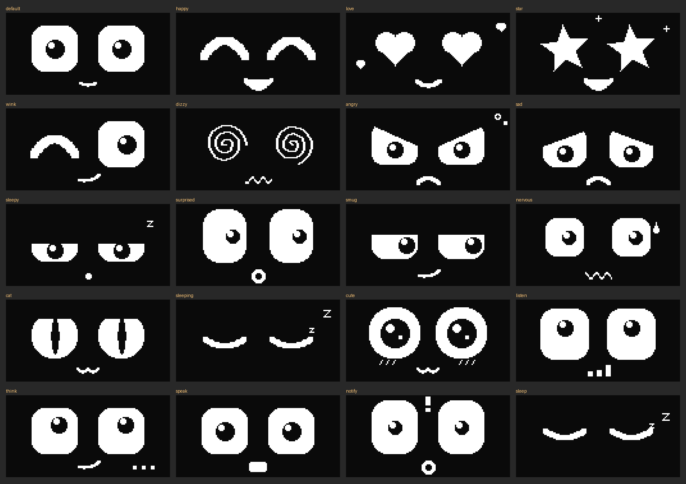
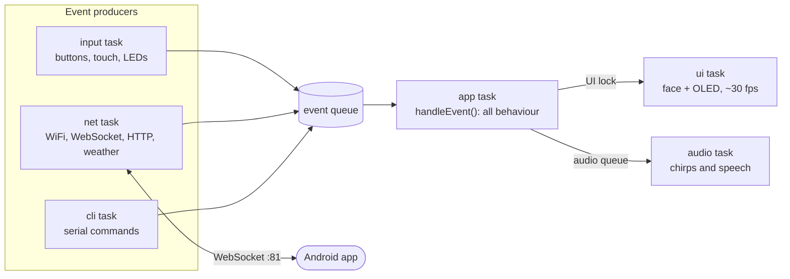

<h1 align="center">DeskBuddy v2</h1>

<p align="center">
  A desk companion that keeps your phone out of reach without making you miss what matters.<br>
  An ESP32 with an animated face called <b>Mochi</b>, a native Android app, and one small protocol between them.
</p>

<p align="center">
  
  
  
  
  
</p>

<p align="center">
  
  <br><sub>All of Mochi's moods and states, rendered by the PC face simulator in <a href="tools/face-sim">tools/face-sim</a>.</sub>
</p>

> **v2 is a rebuild of [DeskBuddy v1](https://github.com/MONKEYDPARI019/DeskBuddy)** (ESP8266, MQTT/HTTP through an automation app). The v1 write-up is kept in [`docs/archive-v1/`](docs/archive-v1/).

---

## Why this exists

I'm a student, and I kept losing focus to my phone: checking the time turned into fifteen minutes of scrolling. But switching the phone off meant missing the calls and messages that actually matter.

DeskBuddy sits on the desk and shows only what I need: the time, the weather, and notifications from the apps I choose. The phone stays out of reach.

v1 proved the idea. v2 is the "do it properly" version: more than a notification display, closer to a single all-in-one desk device, with a firmware built to grow.

## Features

- **Mochi**: 15 moods plus states (boot, idle, notify, listening, thinking, speaking, sleep). Faces are built from parameters (eye size, lid angle, pupil position, mouth), so they glide between moods and blink on their own.
- **Screens**: clock, weather (OpenWeatherMap), Mochi, notifications, pomodoro timer.
- **Phone notifications** through a native Android app, with a per-app filter. No automation app needed.
- **Input**: three buttons (click / hold) and a capacitive touch pad to pat Mochi.
- **Status LEDs**: red = silent mode, yellow = unread notifications, green = network (blinking = WiFi only, solid = app connected).
- **Sound**: chirps and chimes, plus **spoken replies** streamed from the phone to a small speaker. An optional passive buzzer can play the emotion sounds so the speaker is only used for chimes and speech.
- **Voice (in progress)**: INMP441 microphone, push-to-talk on BTN3.
- **Serial CLI** for settings and hardware tests, and a **Python client** to talk to the device from a PC.
- **WiFi setup portal** on first boot, settings saved to flash, OTA updates over WiFi.

## How it works

The firmware is a set of FreeRTOS tasks that never call each other directly. They post small events into one queue, and a single task decides what to do about each one.



| Task | Core | Priority | Job |
|---|---|---|---|
| audio | 0 | 4 | Plays chirps, streams speech to the DAC |
| app | 1 | 3 | The only consumer of the event queue |
| input | 1 | 3 | Buttons, touch pad and LEDs at 50 Hz |
| mic | 0 | 3 | INMP441 capture while push-to-talk is held |
| net | 0 | 2 | WiFi, NTP, mDNS, OTA, HTTP, WebSocket server, weather |
| ui | 1 | 2 | Redraws the face and screens at about 30 fps |
| cli | 1 | 1 | Serial commands |

Design rules that keep it stable:

- Only the app task reads the event queue. Every other module only posts events.
- Face and screen data are protected by one recursive mutex (the UI lock).
- Lock order: never send over the network while holding the UI lock.
- Audio functions only enqueue work for the audio task. Speech flows through a 16 KB stream buffer that absorbs WiFi jitter.
- All settings live in one `Settings` struct, saved to NVS. No secrets in the source: the weather key is set at runtime.

**Why the ESP32 is the WebSocket server:** phones change IP address and Android kills background servers, but a phone can always open an outgoing connection. The device advertises itself over mDNS (`_deskbuddy._tcp`, `deskbuddy.local`), so the app finds it without typing an address, and any number of clients (phone, laptop) can connect at once.

## Hardware

| Part | Pins (GPIO) |
|---|---|
| ESP32 WROOM DevKit (plain ESP32, not S3/C3) | – |
| 0.96" SSD1306 OLED 128×64, I2C | SDA 21, SCL 22 |
| 3 push buttons to GND | BTN1 32, BTN2 33, BTN3 27 |
| Touch pad (copper tape, a coin, or a paper clip) | 4 |
| LEDs red / yellow / green, each with a resistor | 16 / 17 / 18 |
| PAM8403 amplifier + small speaker | DAC 25 (L) |
| Passive buzzer (optional, for emotion sounds) | 19 |
| INMP441 I2S microphone (optional) | SCK 14, WS 13, SD 34 |

- Breadboard wiring, step by step: [`hardware/WIRING.md`](hardware/WIRING.md)
- Full pin table with notes: [`hardware/PINOUT.md`](hardware/PINOUT.md)
- Carrier-board netlist and parts list for a future PCB: [`hardware/PCB_SCHEMATIC.md`](hardware/PCB_SCHEMATIC.md)

## Controls

| Input | Click | Hold |
|---|---|---|
| **BTN1** | next mood (on the notification screen: next notification) | clear notifications |
| **BTN2** | next screen: clock, weather, Mochi, notifications, pomodoro | silent mode on/off |
| **BTN3** | start/pause pomodoro, refresh weather, or wink | **push-to-talk** (on the pomodoro screen: reset) |
| **Touch pad** | pat Mochi and it purrs | – |

After 5 minutes of inactivity (`sleep_sec`), Mochi falls asleep and the display dims. Any input wakes it.

## Quick start

### 1. Firmware

You need [PlatformIO](https://platformio.org/) (VS Code extension or CLI).

```bash
pio run -t upload            # first flash, over USB
pio device monitor           # serial CLI at 115200
pio run -e ota -t upload     # later, over WiFi (deskbuddy.local)
```

On first boot Mochi opens a WiFi network called **DeskBuddy_Setup**. Join it from your phone and pick your home WiFi. Then, in the serial monitor:

```
set owm_key <your OpenWeatherMap key>
set owm_city Bengaluru
save
```

Check your wiring with `test oled`, `test leds`, `test buzzer`, `test speaker`, `test buttons`, `test touch`. Type `help` for everything.

### 2. Android app

Open [`android/`](android/) in Android Studio (File → Open) and let Gradle sync, then run it on a phone on the same WiFi as DeskBuddy. Requires Android 8.0+ (API 26).

1. Tap **Find**, or type the IP address that `status` prints in the serial monitor, then connect.
2. Grant **notification access** so the app can forward notifications.
3. Pick which apps are allowed to reach Mochi in **Setup**.

### 3. Without the app

```bash
curl "http://deskbuddy.local/notify?app=Gmail&title=New%20mail&msg=Hello"

pip install websockets
python tools/deskbuddy_client.py monitor            # watch everything the device sends
python tools/deskbuddy_client.py face love
python tools/deskbuddy_client.py notify "WhatsApp" "Mom" "Dinner is ready"
```

If `deskbuddy.local` doesn't resolve on your PC, pass `--host <ip>`.

## Serial CLI

| Command | What it does |
|---|---|
| `status`, `get` | system status, all settings |
| `set <key> <value>`, `save`, `defaults` | change, store or reset settings |
| `face <name>`, `screen <name>`, `sound <name>` | drive Mochi from the keyboard |
| `notify <text>` | fake a notification |
| `test <oled\|leds\|buzzer\|speaker\|buttons\|touch\|mic>` | check one piece of hardware |
| `wifi reset`, `reboot` | forget WiFi and reopen the portal, restart |

A few useful settings: `volume`, `silent`, `brightness`, `sleep_sec`, `touch_th`, `emo_buzzer` (play emotion sounds on the buzzer), `mic_en`.

## App protocol

The app and the device talk JSON over a WebSocket (`ws://deskbuddy.local:81/`), plus binary frames for audio. App to device: `face`, `screen`, `sound`, `notify`, `set`, `ptt`, `say_start` / audio / `say_end`. Device to app: `state` (every change and every 10 s), `button`, `touch`, `ptt_start` / audio / `ptt_end`. The full reference is in [`docs/PROTOCOL.md`](docs/PROTOCOL.md).

## Project structure

```
src/        ESP32 firmware (main, config, events, display, face, sensors, audio, mic, net, cli)
android/    Kotlin + Jetpack Compose companion app
docs/       PROTOCOL.md, archive-v1/ (the original v1 documents), img/
hardware/   PINOUT.md, WIRING.md, PCB_SCHEMATIC.md
tools/      deskbuddy_client.py (PC test client), face-sim/ (face simulator)
```

## Status

| Area | State |
|---|---|
| OLED, faces, screens, buttons, LEDs | working on hardware |
| WiFi portal, NTP, weather | working on hardware |
| Android app, WebSocket link, notification forwarding | working on hardware |
| Speaker and buzzer | working on hardware |
| Touch pad | working on hardware |
| OTA updates | implemented, not yet verified on my board |
| Microphone and push-to-talk | implemented, waiting for the INMP441 to arrive |
| Real voice assistant behind push-to-talk | not started (the app echoes or gives a placeholder reply) |

Firmware version: `2.0.0-dev`. The app's own version is `0.2.0`.

## Roadmap

- Test the microphone and push-to-talk end to end.
- Plug a speech-to-text and assistant step into `VoiceLoop.answer()` in the app.
- A carrier PCB (KiCad) so it stops being a breadboard.
- A 3D-printed or laser-cut case.

More in [`ROADMAP.md`](ROADMAP.md) and [`CHANGELOG.md`](CHANGELOG.md).

## Built with AI, and what I did

I built v2 with Claude as a coding partner, partly to find out how far AI can take a real hardware project. It wrote a large share of the code. I came up with the idea and the feature set, wired and tested everything on real hardware, found the bugs that only show up on a physical board (a speaker hiss that a resistor value fixed, wiring and pin-label mix-ups, power and ground problems), made the design calls (the retro app, the buzzer for emotion sounds, per-app filtering), and worked through the code until I could explain how each part fits together.

If you spot something wrong, issues and pull requests are welcome.

## Credits

- The original DeskBuddy firmware demo that inspired v1: <https://lnkd.in/geDVPAnu>. v1 and v2 are my own rebuild of that idea.
- Libraries: [U8g2](https://github.com/olikraus/u8g2), [ArduinoJson](https://arduinojson.org/), [WiFiManager](https://github.com/tzapu/WiFiManager), [OneButton](https://github.com/mathertel/OneButton), [WebSockets](https://github.com/Links2004/arduinoWebSockets). Android: Jetpack Compose and OkHttp.
- Fonts in the app: Press Start 2P and VT323, under the SIL Open Font License (see `android/FONTS-OFL.txt`).

## License

MIT, see [LICENSE](LICENSE).
